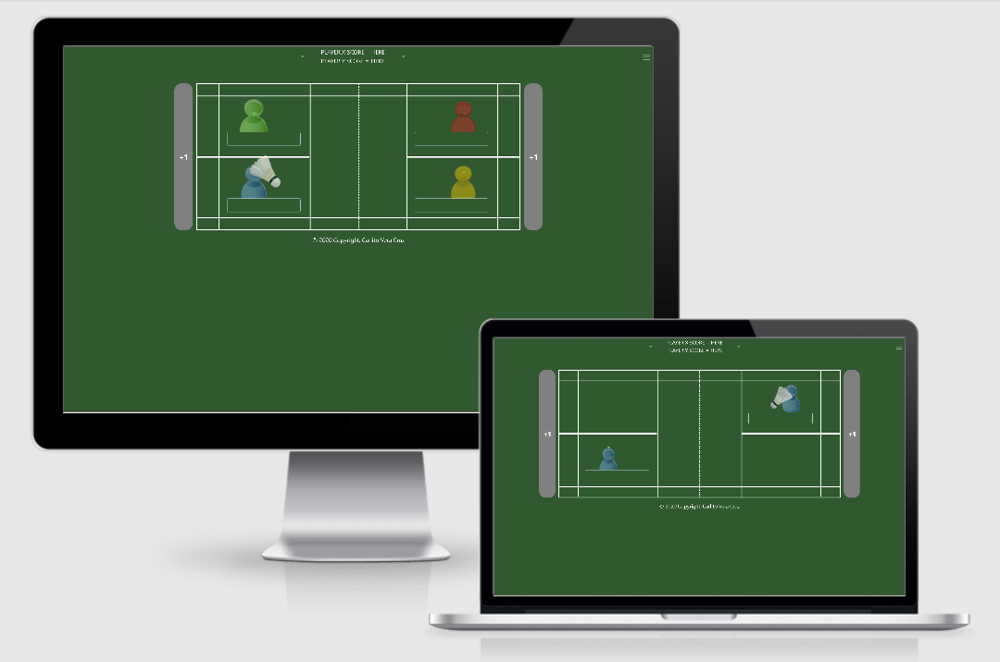
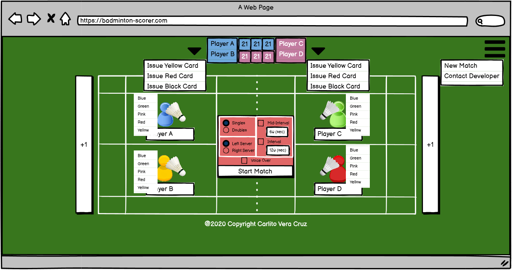

# **MILESTONE PROJECT 2** #

# **BADMINTON-SCORER | WEB APPLICATION** #

Welcome to the Badminton-Scorer!

This web application is designed to give the user (badminton umpire in particular) the ability to mock and automate badminton game play scoring system. The app is best experienced on mobile devices (usually tablets and portable/compact laptop used by badminton umpire during badminton game). Technology programming language used are jquery, javascript, html and css. 

For guidance on how to use the app, please see the "About the App" on the menu drop down list.

For guidance on what badminton game is and the rules of the game, please visit the official badminton website http://www.worldbadminton.com/rules/. 

This project will demonstrate what has been learned so far throughout the 2nd milestone of the Full Stack Development course provided by Code Institute and will present the webpage user useful information in creating an Interactive Front End web application using HTML, CSS, JavaScript and JQuery.

## **CONTENTS** ##

 

- [Project Goals](#project-goals)
- [UX](#ux)
  - [User Stories](#user-stories)
    - [As Is](#as-is)
    - [To Be](#to-be)
  - [Design and Development Process](#design-process)
    - [Fonts](#fonts)
    - [Tools, Technology and Framework Used](#tools-technology-and-framework-used)
- [Features](#features)
    - [Features Implemented](#features-implemented)
    - [Future Enhancements](#future-Enhancements)
- [Testing](#testing)
    - [Encountered Issues](#encountered-issues)
    - [Known Issues](#known-issues)
- [Live Deployment](#live-deployment)
- [Credits](#credits)
- [Acknowledgements](#acknowledgements)

 

## <ins>PROJECT GOALS</ins> ##

The main objective of this 2nd Milestone project was to create a web application that will enable a user (badminton umpire specifically) to mock a badminton game live scoring (with option of voice over for the game status/score).

--- 
## **UX** ##

### <ins>USER STORIES</ins> ###

#### <ins>AS IS</ins> ####
- As a **user**, I want to start a new badminton match game scorer.
- As a **user**, I want to be able to select between singles/doubles match.
- As a **user**, I want to be able to select the court side who will serve initially.
- As a **user**, I want to be able to select/input interval time for mid-game break and full-game break.
- As a **user**, I want to be able to hear the game status with a voice over.
- As a **user**, I want to be able to input the names for each of the player playing on the court.
- As a **user**, I want the system to mock the player's and serving positioning on the court whenever a point is given to a team/player.
- As a **user**, I want to be able to mock penalty cards on the scoreboard if a penalty has been to a team/player.
- As a **user**, I want to be able to end the end game if needed.
- As a **user**, I want to be able to view the end game result tally score/sheet when the game ends.

#### <ins>TO BE</ins> ####
- As a **user**, I want to be able to undo the last action if mistake has been made.
- As a **user**, I want to be able to adjust the score manually.
- As a **user**, I want to be able to change the player's position on the court.
- As a **user**, I want to be select/input the number of games to be played (Best of 1, Best of 3, Best of 5). (The official badminton game match is usually "Best of 3").
- As a **user**, I want to be able to select different voice over person (male, female, pitch, etc).

[Back to Contents](#contents)

--- 
### <ins>DESIGN AND DEVELOPMENT</ins> ###

#### <ins>FONTS</ins> ####

- [Google Fonts](https://fonts.google.com/) - Roboto font family is used for the website

#### <ins>TOOLS TECHNOLOGY and FRAMEWORK USED</ins> ####

- [Balsamic Wireframes](https://balsamiq.com/wireframes) - is used to create the initial mock-up of the badminton scoring system web-app. The full bmpr (balsamic) version of the web-app design can be found [here](assets/misc/ms-project-2.bmpr) while a pdf version of the wireframe can be found [here](assets/misc/ms-project-2.pdf). The web app initial design changed during development process.
- [HTML](https://developer.mozilla.org/en-US/docs/Web/HTML)
- [CSS](https://developer.mozilla.org/en-US/docs/Web/CSS)
- [JavaScript](https://developer.mozilla.org/en-US/docs/Web/JavaScript) 
- [jQuery](https://jquery.com/)
- [Font-Awesome](https://fontawesome.com/icons?d=gallery) - icons used on the website came from here.
- [Bootstrap](https://getbootstrap.com/) - Bootstrap is used for the most part of the website for its responsive design.
- [Popper](https://popper.js.org/)
- [Popper JS](https://popperjs.org/)
- [Git](https://git-scm.com/) - version control and recording of all changes to site during development process
- [GitHub](https://github.com/) - used for hosting website
- [GitPod](https://www.gitpod.io/) - IDE used for code editing.
- [Chrome Developer Tools](https://developers.google.com/web/tools/chrome-devtools) - is used to debug and test site responsiveness on all screen sizes.
- [Google Fonts](https://fonts.google.com/) - used to select font families
- [W3C Validator](https://validator.w3.org/) - used to test my HTML to ensure there were no errors
- [W3C Validator CSS](https://jigsaw.w3.org/css-validator/) - used to test my CSS to ensure there were no errors
- [HTML Formatter](https://www.webformatter.com/html) - html formatter to help keep things tidy!
- [JShint](https://jshint.com/) - used to validate javascript codes, there were some line of codes validated (mostly on the "ternary operator" shortcut) but as far as the logic is concerned it is working accordingly!
- [Am I Responsive](http://ami.responsivedesign.is/#) - used to create responsive image for readme.MD

[Back to Contents](#contents)

---

## **FEATURES** ##

### <ins>FEATURES IMPLEMENTED</ins> ###
- Bootstrap NavBar is used so the user can navigate with the app other features.
- Single page that have the mock-up of badminton court layout design, players icon that can change color, badminton shutllecock icon that can be interchange according to badminton serving rules, scoreboard, player's name etc.
- Hover is used on all clickable links.

### <ins>FUTURE ENHANCEMENTS</ins> ###
- user will be able to select/input the number of games to play (Best of 1, Best of 3, Best of 5, etc).
- user will be able to undo the last action made. In real time, badminton umpire rarely make mistakes on the badminton point system.
- user will be able to pause the game to correct the score or switch players and/or server (Though in official badminton game, only the last action/score can be corrected if the umpire made a mistake)
- user will be able to select different type of voice over (male, female, pitch, etc)
- user will be able to print report of the game, including scores, tally sheets and possibly some metrics.

[Back to Contents](#contents)

---

## **TESTING** ##

The sites responsiveness was tested by the following methods:

- used different web browser (Google Chrome, Mozilla Firefox, Microsoft Edge) to check for compatibility issue.
- Physical testing was conducted on desktop, tablet and mobile devices.
- All buttons and clickable links and images were tested to ensure they are working as expected.
- HTML, CSS, JavaScript and JQuery codes were formatted and validated through accessible online resources (see [Tools, Technology and Framework Used](#tools-technology-and-framework-used)) 
- test cases where tested against the web app and can be found [here](assets/misc/testcases.xlsx)

### <ins>ENCOUNTERED ISSUES</ins>

Below is/are the issues encountered during development and testing:

- when the device is rotated to portrait, the whole web-app design was compromised.
- voice over cannot keep up if users click the score button many times
- Using the DevTools simulator, there is an issue on some mobile devices that I cannot still figure out yet. When user visited the app on portrait mode the app is supposed to get a pop-up message to change the orientation to landscape. 

### <ins>SOLUTION ON ISSUES ENCOUNTERED</ins>

Below is/are the solution provided on the issues encountered above:

- user of the app will be prompted to change orientation.
- introduced a delay until the voice over finished speaking before user can again click the button. (though in real badminton game which the application is mocking, the umpire will not click the score button many times and will wait until the players are ready to play (usually between 5-10 seconds which is enough for the voice-over to finished announcing the current scores))
- one @media in css that force the orientation to landscape was supposed to be removed when i created the pop-up but missed to delete completely causing the issue. 

[Back to Contents](#contents)

---

## **LIVE DEPLOYMENT** ##

The site is hosted on [GitHub Pages](https://jon2-vera-cruz.github.io/badminton-scorer/). 

Deploying on github/gitPod is simple with fewer steps to follow.

1. On the github page, under the repository you are working with, go to the Settings menu.
2. Under the GitHub pages section, select the branch where you want to publish your page.
3. Under the same section, select the folder where you want to publish your page.
4. Once done, click the Save button. The github page will refresh/reload and it will reflect the URL where your pages are published.

1. On the gitpod page, once you're satisfied with all your changes, save your work.
2. On the window terminal, type in the following and press Enter after each line.
    * git add .
    * git commit - m "Place your change description here."
    * git push
3. Sometimes, it will take a few minutes before your changes will be reflected on the published URL provided on github.

[Back to Contents](#contents)

---

## **CREDITS** ##

Code Institute Challenges and Projects throughout 2nd Milestone - This is my very first web application which I am proud of accomplishing within a very short period of time. A few more enhancements and this will really be beneficial to one of my favourite sport that I play, badminton, and hope this will help the badminton umpires a lot.

[Back to Contents](#contents)

---

## **ACKNOWLEDGEMENTS** ##

Thank you to the following people:

- Akshat Garg, my mentor, for his time in providing guidance, and who keeps pushing me to go beyond what was expected on this project...
- Class of August-CI-2020 on Slack,
- #peer-code-review / #interactive-frontend folks on slack (you know who you are :P ) who gave some of their time reviewing, specially finding what is causing the issue encountered, and giving feedback and suggestions.

[Back to Contents](#contents)
