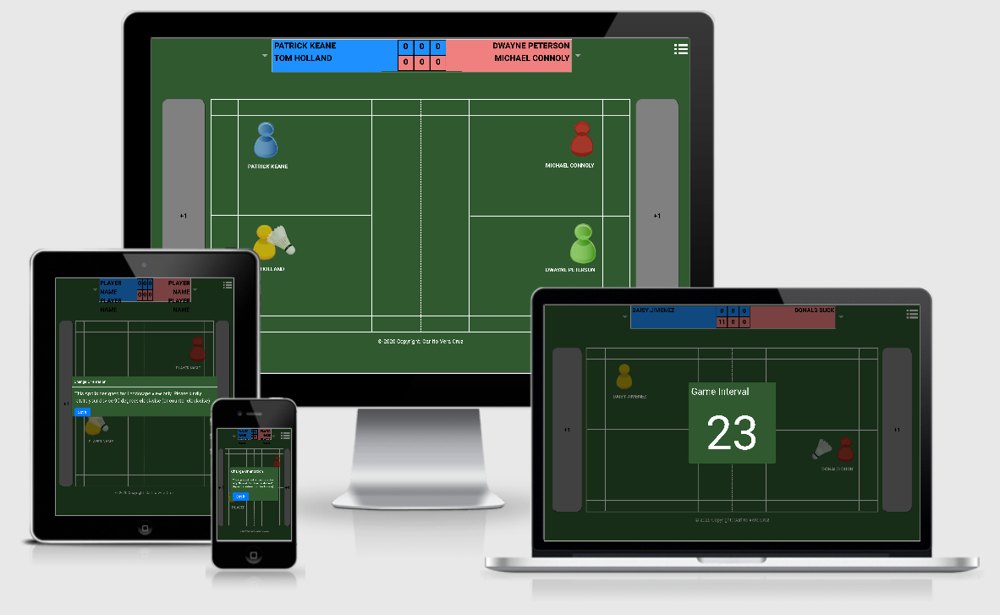

# **MILESTONE PROJECT 2** #

# **BADMINTON-SCORER | WEB APPLICATION** #

Welcome to the Badminton-Scorer!

This web application is designed to give the user the ability to automate badminton game play using jquery, javascript, html and css. For the official badminton rules guidance, you can visit http://www.worldbadminton.com/rules/.  

This project will demonstrate what has been learned so far throughout the 2nd milestone of the Full Stack Development course provided by Code Institute and will present the webpage user useful information in creating an Interactive Front End web application using HTML, CSS, JavaScript and JQuery.

## **CONTENTS** ##

 

- [Project Goals](#project-goals)
- [UX](#ux)
  - [User Stories](#user-stories)
    - [As Is](#as-is)
    - [To Be](#to-be)
  - [Design and Development Process](#design-process)
    - [Fonts](#fonts)
    - [Tools, Technology and Framework Used](#tools-technology-and-framework-used)
- [Features](#features)
    - [Features Implemented](#features-implemented)
    - [Future Enhancements](#future-Enhancements)
- [Testing](#testing)
    - [Encountered Issues](#encountered-issues)
    - [Known Issues](#known-issues)
- [Live Deployment](#live-deployment)
- [Credits](#credits)
- [Acknowledgements](#acknowledgements)

 

## <ins>PROJECT GOALS</ins> ##

The main objective of this 2nd Milestone project was to create a web application that will enable a user to mock a badminton game live scoring (with option of voice over for the game status/score).

--- 
## **UX** ##

### <ins>USER STORIES</ins> ###

#### <ins>AS IS</ins> ####
- As a **new user**, I want to start a new badminton match game scorer.
- As a **new user**, I want to be able to select between singles/doubles match, select the side serving initially and input interval time for mid-game break and full-game break for players.
- As a **new user**, I want to be able to hear the game status with a voice over.

#### <ins>TO BE</ins> ####
- As a **new user**, I want to be select/input the number of games to be played (Best of 1, Best of 3, Best of 5). (The official badminton game match is "Best of 3").
- As a **new user**, I want to be able to select different voice over person (male, female, pitch, etc).

[Back to Contents](#contents)

--- 
### <ins>DESIGN AND DEVELOPMENT</ins> ###

#### <ins>FONTS</ins> ####

- [Google Fonts](https://fonts.google.com/) - Roboto font family is used for the website

#### <ins>TOOLS TECHNOLOGY and FRAMEWORK USED</ins> ####

- [Balsamic Wireframes](https://balsamiq.com/wireframes) - is used to create the initial mockup of the web-app. A bmpr (balsamic) version of the web-app design can be found [here](assets/misc/ms-project-2.bmpr) while a pdf version of the wireframe can be found [here](assets/misc/ms-project-2.pdf). The web page initial design changed during the course of development process.
- [HTML](https://developer.mozilla.org/en-US/docs/Web/HTML)
- [CSS](https://developer.mozilla.org/en-US/docs/Web/CSS)
- [JavaScript](https://developer.mozilla.org/en-US/docs/Web/JavaScript) 
- [jQuery](https://jquery.com/)
- [Bootstrap](https://getbootstrap.com/) - Bootstrap is used for the most part of the website for its responsive design.
- [Popper](https://popper.js.org/)
- [Popper JS](https://popperjs.org/)
- [Git](https://git-scm.com/) - version control and recording of all changes to site during development process
- [GitHub](https://github.com/) - used for hosting website
- [GitPod](https://www.gitpod.io/) - IDE used for code editing.
- [Chrome Developer Tools](https://developers.google.com/web/tools/chrome-devtools) - is used to debug and test site responsiveness on all screen sizes.
- [Google Fonts](https://fonts.google.com/) - used to select font families
- [W3C Validator](https://validator.w3.org/) - used to test my HTML to ensure there were no errors
- [W3C Validator CSS](https://jigsaw.w3.org/css-validator/) - used to test my CSS to ensure there were no errors
- [HTML Formatter](https://www.webformatter.com/html) - html formatter to help keep things tidy!
- [Am I Responsive](http://ami.responsivedesign.is/#) - used to create responsive image for readme.MD

[Back to Contents](#contents)

---

## **FEATURES** ##

### <ins>FEATURES IMPLEMENTED</ins> ###
- Bootstrap NavBar is used so the user can navigate the site easily.
- Single page that have the mock badminton court design, players icon that can change color, the shutllecocl icon that can be interchange according badminton serving rules, scoreboard, players etc.
- Hover is used on all clickable links.

### <ins>FUTURE ENHANCEMENTS</ins> ###
- user will be able to select/input the number of games to play (Best of 1, Best of 3, Best of 5, etc)
- user will be able to pause the game to correct the score or switch players and/or server (Though in official badminton game, only the last action/score can be corrected if the umpire made a mistake)
- user will be able to select different type of voice over (male, female, pitch, etc)
- user will be able to print report of the game, including scores, tally and possibly some metrics.

[Back to Contents](#contents)

---

## **TESTING** ##

The sites responsiveness was tested by the following methods:

- used different web browser (Google Chrome, Moxilla Firefox, Microsoft Edge) to check for compatibility issue.
- Physical testing was conducted on desktop, tablet and mobile devices.
- All buttons and clickable links and images were tested to ensure they are working as expected.
- HTML, CSS, JavaScript and JQuery codes were formatted and validated through accessible online resources (see [Tools, Technology and Framework Used](#tools-technology-and-framework-used)) 

Test Case checklist can be found [here](assets/misc/ms2-test-case-checklist.xls)

### <ins>ENCOUNTERED ISSUES</ins>

Below is/are the issues encountered during development and testing:

- when the device is rotated to portrait, the whole web-app design was compromised.
- voice over can't keep up if users click the score button many times 

### <ins>SOLUTION ON ISSUES ENCOUNTERED</ins>

Below is/are the solution provided on the issues encountered above:

- forced the web-application to load on landscape mode only.
- need to introduce a delay until the voice over finished speaking before user can again click the button. (though in real game which the scorer is mocking, the umpire will not click the score button many times)

[Back to Contents](#contents)

---

## **LIVE DEPLOYMENT** ##

The site is hosted on [GitHub Pages](https://jon2-vera-cruz.github.io/badminton-scorer/). "How To - Deploying to GitHub Pages" can be found [here](https://www.codecademy.com/articles/f1-u3-github-pages).

[Back to Contents](#contents)

---

## **CREDITS** ##

Code Institute Challenges and Projects throughout 2nd Milestone - My very first web application which I am really proud of accomplishing with a very short period of time. A few more enhancement and this will really be beneficial to one of my favourite sport that I play, badminton, and hope this will help the badminton umpires a lot.

[Back to Contents](#contents)

---

## **ACKNOWLEDGEMENTS** ##

Thank you to the following people:

- Akshat Garg, my mentor, for his time in providing guidance, and online resources to help make it through this 1st milestone project...
- Class of August-CI-2020 on Slack,
- #peer-code-review / #interactive-frontend folks on slack (you know who you are :P )who gave some of their time reviewing and giving feedback and suggestions.

[Back to Contents](#contents)
